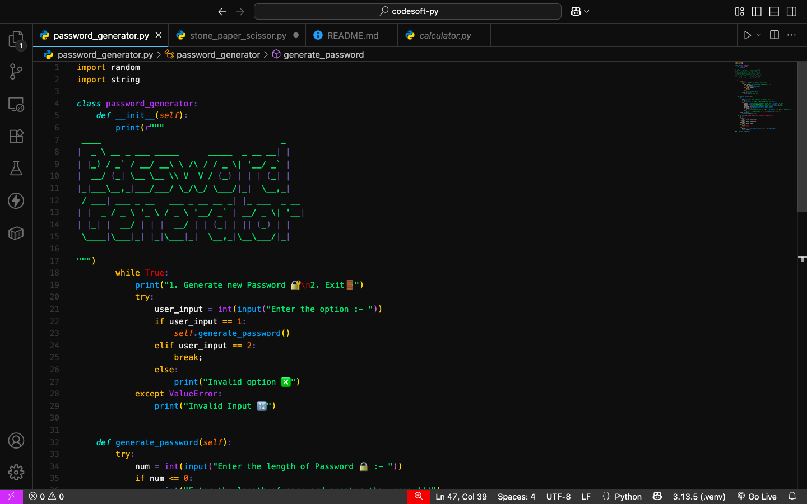
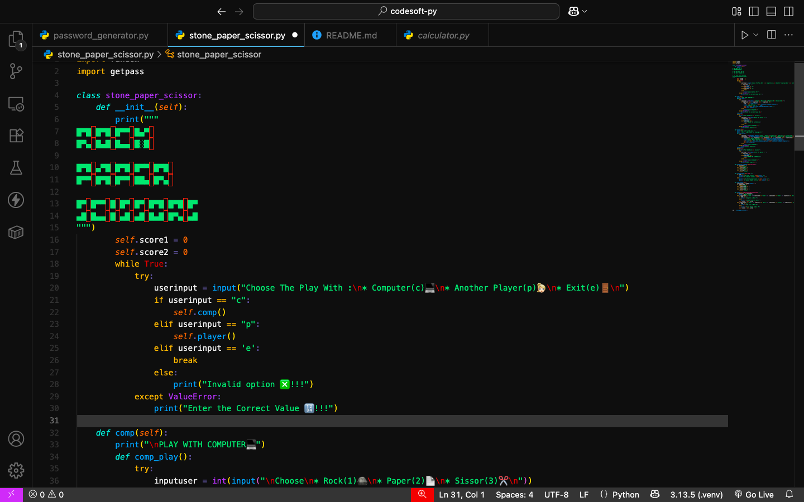
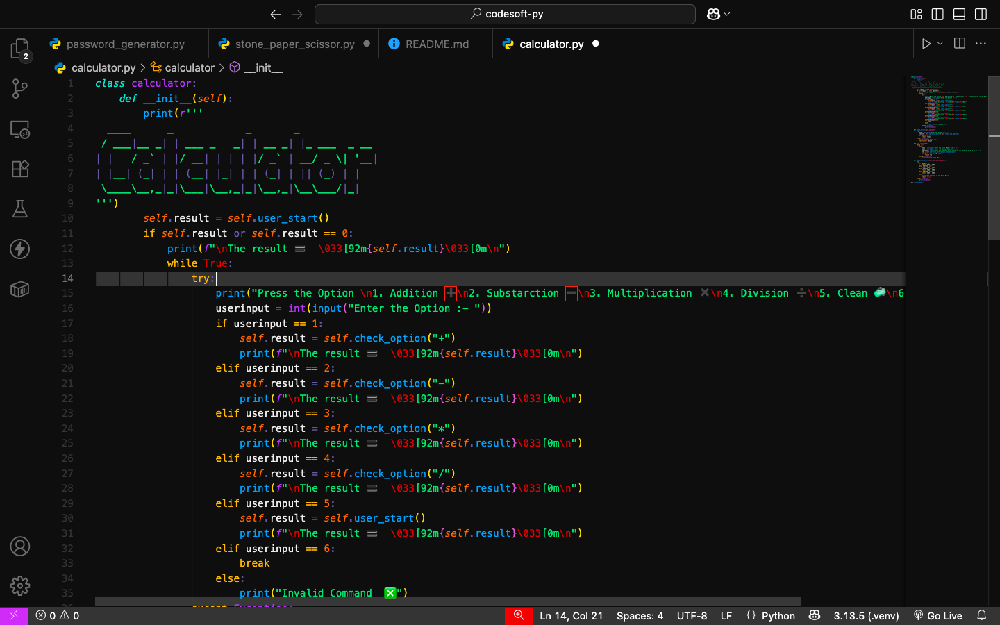

# 💻 CodSoft Python Internship Projects







This repository contains the Python projects I completed as part of my internship at **CodSoft**. These beginner-friendly projects helped me apply and strengthen my programming knowledge through real-world examples.

## 🛠️ Projects Included

### 1. 🔐 Password Generator
A simple Python program that generates strong, random passwords using letters, numbers, and special characters.

**Features:**
- Customizable password length
- Mix of uppercase, lowercase, digits, and symbols

### 2. 🪨📄✂️ Stone, Paper & Scissors Game
A command-line version of the classic Stone, Paper, Scissors game where the user plays against the computer.

**Features:**
- Random choice by computer
- User vs. computer gameplay
- Simple game logic and replay option

### 3. 🧮 Basic Calculator
A basic calculator that performs arithmetic operations like addition, subtraction, multiplication, and division.

**Features:**
- Takes user input
- Performs basic math operations
- Handles divide-by-zero and invalid inputs

## 🚀 Getting Started

1. Clone the repository:

```bash
git clone https://github.com/hunjanhar/CODSOFT.git


